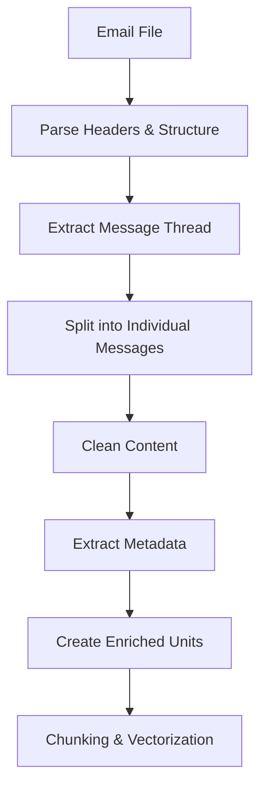

# Email Extractor Design Plan

**Status: ✅ COMPLETED - Implementation finished and tested**

**Implementation Location:** `ingest/extractors/email_extractor.py`
**Documentation:** `docs/EMAIL_PROCESSING.md`
**Test Results:** All tests passed, integrated with main pipeline

## Problem Analysis

Emails are fundamentally different from other document types because:

1. **Threaded Conversations**: A single .eml/.msg file may contain multiple replies/forwards
2. **Rich Metadata**: Sender, recipient, date, subject, CC/BCC, attachments
3. **Structured Content**: Headers, body, signatures, quoted text
4. **Multiple Formats**: Plain text, HTML, attachments
5. **Contextual Relationships**: Reply chains, forwarding history

## Proposed Approach

### 1. Email Parsing Strategy

**File Format Support:**
- `.eml` files (standard email format)
- `.msg` files (Outlook format) 
- Potentially `.mbox` (mailbox files)

**Libraries to Use:**
- `email` (Python standard library) for .eml parsing
- `extract-msg` or `msg-extractor` for .msg files
- `mailbox` for .mbox files

### 2. Email Thread Decomposition

**Strategy**: Parse email threads into individual message units rather than treating as single blob

**Unit Structure**:
```python
EmailUnit = Tuple[unit_id, content]
# Where unit_id includes metadata: "email_{msg_index}_{sender}_{date}"
# Content includes: headers + body + context
```

**Example Threading**:
```
Original Email (2024-01-15, alice@company.com)
├── Reply 1 (2024-01-16, bob@company.com)  
├── Reply 2 (2024-01-17, alice@company.com)
└── Forward (2024-01-18, charlie@company.com)
```

### 3. Metadata Extraction

**Core Metadata** (stored in unit_id and SQLite):
- **Sender**: From address
- **Recipients**: To, CC, BCC
- **Timestamp**: Date/time sent
- **Subject**: Email subject line
- **Message-ID**: Unique identifier
- **Thread-ID**: Conversation grouping
- **References**: Reply/forward chain

**Content Metadata**:
- **Attachments**: List of attachment names/types
- **Message Type**: Original/Reply/Forward
- **HTML/Text**: Content format

### 4. Content Processing Pipeline



**Content Cleaning Steps**:
1. **HTML Stripping**: Convert HTML to clean text
2. **Signature Removal**: Detect and remove email signatures
3. **Quote Trimming**: Handle quoted text from replies
4. **Normalization**: Clean formatting, extra whitespace

### 5. Unit Creation Strategy - APPROVED APPROACH

**Option B: Thread-Level Units** (User Selected)
```python
units = [
    ("email_thread_project_update_2024-01-15", "Subject: Project Update\nThread: 4 messages\n\n[Message 1] From: alice@company.com | Date: 2024-01-15\nHi team, here's the project update...\n\n[Message 2] From: bob@company.com | Date: 2024-01-16\nThanks Alice, I have some questions...\n\n[Message 3] From: alice@company.com | Date: 2024-01-17\nBob, here are the answers...\n\n[Message 4] From: charlie@company.com | Date: 2024-01-18\nForwarded to management team...")
]
```

**Benefits of Thread-Level Approach**:
- **Context Preservation**: Full conversation context maintained
- **Relationship Understanding**: Complete thread relationships visible
- **Coherent Retrieval**: Related messages retrieved together
- **Temporal Flow**: Natural conversation flow preserved

### 6. Enhanced Metadata Storage - APPROVED APPROACH

**Dedicated Email Table** (Recommended for complex metadata):
```sql
-- Create dedicated email_metadata table
CREATE TABLE email_metadata (
    chunk_id TEXT PRIMARY KEY,
    thread_id TEXT,
    subject TEXT,
    sender_email TEXT,
    sender_name TEXT,
    recipients_to TEXT,  -- JSON array
    recipients_cc TEXT,  -- JSON array
    recipients_bcc TEXT, -- JSON array
    date_sent TEXT,
    message_count INTEGER,
    has_attachments BOOLEAN,
    attachment_names TEXT, -- JSON array
    client_type TEXT,      -- Outlook, Gmail, etc.
    FOREIGN KEY (chunk_id) REFERENCES chunks(id)
);
```

**Benefits**:
- Clean separation of email metadata
- Efficient queries on email-specific fields
- Extensible for future email features
- No impact on existing chunks table structure

### 7. Search & Retrieval Enhancements

**Query Capabilities**:
- Search by sender: "emails from alice@company.com"
- Search by date range: "emails from last week"
- Search by subject: "emails about project update"
- Search by thread: "all messages in this conversation"

**Vector Search Improvements**:
- Include sender/subject in embedding context
- Weight recent emails higher
- Consider thread relationships in similarity

### 8. Implementation Plan

**Phase 1: Basic Email Extractor**
1. Create `email_extractor.py` with support for .eml files
2. Implement basic header parsing and content extraction
3. Create message-level units with metadata

**Phase 2: Advanced Features**
1. Add .msg file support
2. Implement thread decomposition
3. Add signature and quote removal
4. Enhanced metadata extraction

**Phase 3: Integration**
1. Update vector store schema for email metadata
2. Enhance search capabilities
3. Add email-specific query features

### 9. Example Implementation Structure

```python
class EmailExtractor(BaseExtractor):
    @property
    def supported_extensions(self) -> List[str]:
        return [".eml", ".msg"]
    
    def extract(self, path: Path) -> List[Unit]:
        if path.suffix.lower() == ".eml":
            return self._extract_eml(path)
        elif path.suffix.lower() == ".msg":
            return self._extract_msg(path)
    
    def _extract_eml(self, path: Path) -> List[Unit]:
        # Parse .eml file using email library
        # Decompose into individual messages
        # Extract metadata and clean content
        # Return list of (unit_id, content) tuples
        
    def _parse_thread(self, email_message) -> List[Dict]:
        # Identify reply/forward chains
        # Split into individual messages
        # Preserve threading relationships
        
    def _clean_content(self, content: str, content_type: str) -> str:
        # Remove HTML tags
        # Clean signatures
        # Handle quoted text
        # Normalize whitespace
```

### 10. Testing Strategy

**Test Cases**:
- Single email messages
- Email threads with multiple replies
- Emails with attachments
- HTML vs plain text emails
- Various email clients (Outlook, Gmail, etc.)
- Malformed or truncated emails

## User Decisions - APPROVED ✅

1. **Threading Strategy**: **Thread-Level Units** - Complete conversations as single units for context retention
2. **Metadata Storage**: **Dedicated Email Table** - Separate table for complex email metadata
3. **File Format Priority**: **Start with .msg files** (Outlook format)
4. **Threading Depth**: **All levels** - Parse complete reply chains regardless of depth
5. **Content Cleaning**: **Aggressive signature removal** - Clean up all signatures including text and images

## Questions for Consideration

1. ✅ **Threading Depth**: All levels (User confirmed)
2. **Attachment Handling**: Should we extract text from attachments? (Future enhancement)
3. **Privacy**: Any PII concerns with email content? (User responsibility)
4. **Storage**: How to handle large email archives efficiently?
5. **Deduplication**: How to handle forwarded emails that appear multiple times?

## Next Steps

1. **Review this plan** and provide feedback
2. **Choose preferred unit strategy** (message-level vs thread-level)
3. **Confirm metadata requirements**
4. **Implement Phase 1** with basic .eml support
5. **Test with sample email files**
6. **Iterate based on results**

Would you like me to proceed with implementing the basic email extractor based on this plan?
