# DocQuest Architecture

This document describes the architecture and data flow of the DocQuest (Document Retrieval-Augmented Generation) system.

## System Overview

DocQuest is a local RAG pipeline that quests through documents from local folders and enables natural language querying using vector search and OpenAI. The system is designed to embark on intelligent journeys through personal document collections, team folders, or any local document repository.

## Architecture Diagram

```mermaid
graph TB
    %% User Interface Layer
    subgraph "User Interface"
        CLI[CLI Interface<br/>interface/cli/ask.py]
        API[FastAPI Web API<br/>backend/querying/api.py]
        WebUI[Next.js Web UI<br/>package.json]
    end

    %% Document Sources
    subgraph "Document Sources"
        LocalDocs[Local Documents<br/>📁 sync_root folder]
        PDFs[PDF Files<br/>📄 .pdf]
        Word[Word Docs<br/>📄 .docx]
        Excel[Excel Files<br/>📊 .xlsx]
        PPT[PowerPoint<br/>📄 .pptx]
        TXT[Text Files<br/>📄 .txt]
    end

    %% Processing Pipeline
    subgraph "Document Processing Pipeline"
        Watcher[File Watcher<br/>watcher/watch.py<br/>🔍 Monitors changes]
        
        subgraph "Modular Extractors"
            ExtractorFactory[Extractor Factory<br/>backend/ingestion/extractors/__init__.py<br/>🏭 Routes to specialized extractors]
            PDFExtractor[PDF Extractor<br/>backend/ingestion/extractors/pdf_extractor.py<br/>📄 LangChain + AI image analysis]
            DOCXExtractor[DOCX Extractor<br/>backend/ingestion/extractors/docx_extractor.py<br/>📝 Word document processing]
            PPTXExtractor[PPTX Extractor<br/>backend/ingestion/extractors/pptx_extractor.py<br/>📊 PowerPoint processing]
            XLSXExtractor[XLSX Extractor<br/>backend/ingestion/extractors/xlsx_extractor.py<br/>📈 Excel processing]
            TXTExtractor[TXT Extractor<br/>backend/ingestion/extractors/txt_extractor.py<br/>📄 Plain text processing]
        end
        
        Chunker[Text Chunker<br/>backend/ingestion/processors/chunker.py<br/>✂️ NLTK-based chunking]
        Embedder[Embedding Generator<br/>backend/ingestion/processors/embed.py<br/>🧠 sentence-transformers]
        Pipeline[Ingestion Controller<br/>backend/ingestion/pipeline.py<br/>🔄 Orchestrates pipeline]
    end

    %% Storage Layer
    subgraph "Storage Layer"
        VectorDB[Vector Database<br/>FAISS IndexFlatL2<br/>🗃️ 384-dim embeddings]
        MetaDB[Metadata Database<br/>SQLite<br/>📋 File metadata & chunks]
        ConfigFile[Configuration<br/>config/config.yaml<br/>⚙️ Settings & API keys]
    end

    %% External Services
    subgraph "External Services"
        OpenAI[OpenAI API<br/>🤖 GPT-4o-mini<br/>Question answering]
        HuggingFace[Hugging Face<br/>🤗 Sentence Transformers<br/>Text embeddings]
    end

    %% Data Flow
    LocalDocs --> Watcher
    PDFs --> ExtractorFactory
    Word --> ExtractorFactory
    Excel --> ExtractorFactory
    PPT --> ExtractorFactory
    TXT --> ExtractorFactory
    
    ExtractorFactory --> PDFExtractor
    ExtractorFactory --> DOCXExtractor
    ExtractorFactory --> PPTXExtractor
    ExtractorFactory --> XLSXExtractor
    ExtractorFactory --> TXTExtractor
    
    PDFExtractor --> Chunker
    DOCXExtractor --> Chunker
    PPTXExtractor --> Chunker
    XLSXExtractor --> Chunker
    TXTExtractor --> Chunker
    
    Watcher --> Pipeline
    Pipeline --> ExtractorFactory
    Chunker --> Embedder
    Embedder --> VectorStore
    Embedder --> MetadataDB
    
    CLI --> VectorStore
    API --> VectorStore
    WebUI --> API
    
    VectorStore --> OpenAI
    CLI --> OpenAI
    API --> OpenAI
    
    Embedder --> HuggingFace
    SharedConfig --> Pipeline
    SharedConfig --> OpenAI

    %% Styling
    classDef userInterface fill:#e1f5fe
    classDef processing fill:#f3e5f5
    classDef extractors fill:#e8f5e8
    classDef storage fill:#e8f5e8
    classDef external fill:#fff3e0
    classDef documents fill:#fce4ec

    class CLI,API,WebUI userInterface
    class Watcher,Chunker,Embedder,Pipeline processing
    class ExtractorFactory,PDFExtractor,DOCXExtractor,PPTXExtractor,XLSXExtractor,TXTExtractor extractors
    class VectorStore,MetadataDB,SharedConfig storage
    class OpenAI,HuggingFace external
    class LocalDocs,PDFs,Word,Excel,PPT,TXT documents
```



## Component Details

### Document Processing Flow


### Modular Extractor Architecture

The document extraction system uses a factory pattern with specialized extractors:

#### Factory Pattern (`backend/ingestion/extractors/__init__.py`)
- Routes documents to appropriate extractors based on file extension
- Maintains backward compatibility with existing `extract_text()` interface
- Provides centralized error handling and logging

#### Specialized Extractors (`backend/ingestion/extractors/`)
- **PDF Extractor**: Advanced processing with LangChain and GPT-4 Vision image analysis
- **DOCX Extractor**: Word document paragraph extraction using python-docx
- **PPTX Extractor**: PowerPoint slide-by-slide text extraction
- **XLSX Extractor**: Excel spreadsheet processing with smart sheet prioritization
- **TXT Extractor**: Simple UTF-8 text file processing

#### Benefits
- **Isolation**: Issues with one file type don't affect others
- **Testability**: Each extractor can be unit tested independently
- **Maintainability**: Clear separation of concerns for each document type
- **Extensibility**: New file types can be added by creating new extractor classes
```

### Query Processing Flow


## Key Architecture Decisions

### 1. Local-First Design
- **Rationale**: Privacy, control, and offline capability
- **Implementation**: All processing happens locally, only LLM calls go to OpenAI
- **Benefits**: No data leaves your machine except for question answering

### 2. Modular Processing Pipeline
- **Rationale**: Maintainability, testability, and extensibility
- **Implementation**: 
  - **Factory Pattern**: `backend/ingestion/extractors/__init__.py` routes documents to specialized extractors
  - **Specialized Extractors**: Individual classes for PDF (with AI image analysis), DOCX, PPTX, XLSX, and TXT
  - **Separate Modules**: Independent modules for extraction, chunking, embedding, and storage
- **Benefits**: 
  - Easy to add new file formats by creating new extractor classes
  - Individual extractors can be tested in isolation
  - File type issues don't affect other extractors
  - Clear separation of concerns for each document type

### 3. FAISS + SQLite Hybrid Storage
- **Rationale**: Performance for vector search + flexibility for metadata
- **Implementation**: FAISS for vector similarity, SQLite for rich metadata queries
- **Benefits**: Fast similarity search with detailed provenance tracking

### 4. Enhanced Excel Processing
- **Rationale**: Excel files contain complex structured data requiring special handling
- **Implementation**: Smart sheet prioritization, empty sheet filtering, relationship preservation
- **Benefits**: Better extraction quality from business documents

## Data Flow Patterns

### 1. Document Ingestion
```
File Change → Watcher → Extractor → Chunker → Embedder → Vector Store
```

### 2. Query Processing
```
User Query → Vector Search → Context Retrieval → LLM Processing → Response
```

### 3. Incremental Updates
```
Modified File → Hash Comparison → Selective Re-processing → Vector Store Update
```

## Configuration Architecture

```mermaid
graph LR
    subgraph "Configuration Management"
        Template[config.yaml.template<br/>📝 Safe for git]
        Config[config.yaml<br/>🔒 Local secrets]
        Settings[settings object<br/>⚙️ Runtime config]
    end
    
    Template --> Config
    Config --> Settings
    Settings --> Pipeline[Processing Pipeline]
    Settings --> API[API Services]
    
    classDef config fill:#fff9c4
    class Template,Config,Settings config
```



## Performance Characteristics

- **Vector Dimensionality**: 384 (sentence-transformers/all-MiniLM-L6-v2)
- **Chunk Size**: 800 characters with 150 character overlap
- **Search Results**: Top-8 relevant chunks for context
- **Excel Limits**: 100MB files, 15 sheets (smart prioritization), 2000 rows/sheet
- **Memory Usage**: Scales with document corpus size and concurrent processing

## Security Model

```mermaid
graph TB
    subgraph "Security Boundaries"
        LocalSystem[Local System<br/>🔒 All document processing]
        GitRepo[Git Repository<br/>📁 Public code only]
        OpenAIAPI[OpenAI API<br/>🌐 Query processing only]
    end
    
    LocalSystem -.->|API calls only| OpenAIAPI
    LocalSystem -->|Code only| GitRepo
    
    LocalSystem --> ConfigLocal[config.yaml<br/>🔐 Never committed]
    GitRepo --> ConfigTemplate[config.yaml.template<br/>📝 Safe template]
```



## Extensibility Points

1. **New File Formats**: Add extractors in `backend/ingestion/extractors/`
2. **Different Embeddings**: Modify `backend/ingestion/processors/embed.py` 
3. **Alternative LLMs**: Update `interface/cli/ask.py` and `backend/querying/api.py`
4. **Custom Chunking**: Extend `backend/ingestion/processors/chunker.py`
5. **Additional Metadata**: Enhance `backend/ingestion/storage/vector_store.py`

## Deployment Patterns

### Local Development
```bash
python -m backend.ingestion.pipeline  # Document processing
python -m interface.cli.ask           # CLI queries
uvicorn backend.querying.api:app      # Web API
```

### Production Deployment
- File watcher for real-time updates
- Web UI for team access
- Automated reindexing workflows
- Health monitoring and logging
