# DocQuest Architecture

*Last updated: January 2025*

This document describes the architecture and data flow of the DocQuest (Document Retrieval-Augmented Generation) system.

## System Overview

DocQuest is a local RAG pipeline that quests through documents from local folders and enables natural language querying using vector search and OpenAI. The system is designed to embark on intelligent journeys through personal document collections, team folders, or any local document repository.

## Architecture Diagram

```mermaid
graph TB
    %% User Interface Layer
    subgraph "User Interface"
        CLI[CLI Interface<br/>backend/src/interface/cli/ask.py]
        API[FastAPI Web API<br/>backend/src/querying/api.py]
        WebUI[Next.js Web UI<br/>package.json<br/>📝 Optional/Planned]
    end

    %% Document Sources
    subgraph "Document Sources"
        LocalDocs[Local Documents<br/>📁 sync_root folder]
        PDFs[PDF Files<br/>📄 .pdf]
        Word[Word Docs<br/>📄 .docx]
        Excel[Excel Files<br/>📊 .xlsx]
        PPT[PowerPoint<br/>📄 .pptx]
        TXT[Text Files<br/>📄 .txt]
        Email[Email Files<br/>📧 .msg]
    end

    %% Processing Pipeline
    subgraph "Document Processing Pipeline"
        Watcher[File Watcher<br/>watcher/watch.py<br/>🔍 Optional/Planned]
        
        subgraph "Modular Extractors"
            ExtractorFactory[Extractor Factory<br/>backend/src/ingestion/extractors/__init__.py<br/>🏭 Routes to specialized extractors]
            PDFExtractor[PDF Extractor<br/>backend/src/ingestion/extractors/pdf_extractor.py<br/>📄 LangChain + AI image analysis]
            DOCXExtractor[DOCX Extractor<br/>backend/src/ingestion/extractors/docx_extractor.py<br/>📝 Word document processing]
            PPTXExtractor[PPTX Extractor<br/>backend/src/ingestion/extractors/pptx_extractor.py<br/>📊 PowerPoint processing]
            XLSXExtractor[XLSX Extractor<br/>backend/src/ingestion/extractors/xlsx_simple_extractor.py<br/>📈 Excel processing]
            TXTExtractor[TXT Extractor<br/>backend/src/ingestion/extractors/txt_extractor.py<br/>📄 Plain text processing]
            EmailExtractor[Email Extractor<br/>backend/src/ingestion/extractors/email_extractor.py<br/>📧 Outlook MSG processing]
        end
        
        Chunker[Text Chunker<br/>backend/src/ingestion/processors/chunker.py<br/>✂️ NLTK-based chunking]
        Embedder[Embedding Generator<br/>backend/src/ingestion/processors/embedder.py<br/>🧠 sentence-transformers]
        Pipeline[Ingestion Controller<br/>backend/src/ingestion/pipeline.py<br/>🔄 Orchestrates pipeline]
    end

    %% Storage Layer
    subgraph "Storage Layer"
        VectorStore[VectorStore (FAISS)<br/>IndexFlatL2<br/>🗃️ 384-dim embeddings]
        MetadataDB[MetadataDB (SQLite)<br/>📋 File metadata & chunks]
        ConfigFile[Configuration<br/>config/config.yaml<br/>⚙️ Settings & API keys]
    end

    %% External Services
    subgraph "External Services"
        OpenAI[OpenAI API<br/>🤖 GPT-4o-mini<br/>Question answering]
        HuggingFace[Hugging Face<br/>🤗 Sentence Transformers<br/>Text embeddings]
    end

    %% Data Flow
    LocalDocs --> ExtractorFactory
    PDFs --> ExtractorFactory
    Word --> ExtractorFactory
    Excel --> ExtractorFactory
    PPT --> ExtractorFactory
    TXT --> ExtractorFactory
    Email --> ExtractorFactory
    
    ExtractorFactory --> PDFExtractor
    ExtractorFactory --> DOCXExtractor
    ExtractorFactory --> PPTXExtractor
    ExtractorFactory --> XLSXExtractor
    ExtractorFactory --> TXTExtractor
    ExtractorFactory --> EmailExtractor
    
    PDFExtractor --> Chunker
    DOCXExtractor --> Chunker
    PPTXExtractor --> Chunker
    XLSXExtractor --> Chunker
    TXTExtractor --> Chunker
    EmailExtractor --> Chunker
    
    Pipeline --> ExtractorFactory
    Chunker --> Embedder
    Embedder --> VectorStore
    Embedder --> MetadataDB
    
    CLI --> VectorStore
    API --> VectorStore
    WebUI --> API
    
    CLI --> OpenAI
    API --> OpenAI
    
    Embedder --> HuggingFace

    %% Styling
    classDef userInterface fill:#e1f5fe
    classDef processing fill:#f3e5f5
    classDef extractors fill:#e8f5e8
    classDef storage fill:#e8f5e8
    classDef external fill:#fff3e0
    classDef documents fill:#fce4ec
    classDef optional fill:#f5f5f5,stroke-dasharray: 5 5

    class CLI,API,WebUI userInterface
    class Chunker,Embedder,Pipeline processing
    class ExtractorFactory,PDFExtractor,DOCXExtractor,PPTXExtractor,XLSXExtractor,TXTExtractor,EmailExtractor extractors
    class VectorStore,MetadataDB,ConfigFile storage
    class OpenAI,HuggingFace external
    class LocalDocs,PDFs,Word,Excel,PPT,TXT,Email documents
    class Watcher,WebUI optional
```

## Component Details

### Document Processing Flow


### Modular Extractor Architecture

The document extraction system uses a factory pattern with specialized extractors:

#### Factory Pattern (`backend/src/ingestion/extractors/__init__.py`)
- Routes documents to appropriate extractors based on file extension
- Maintains backward compatibility with existing `extract_text()` interface
- Provides centralized error handling and logging

#### Specialized Extractors (`backend/src/ingestion/extractors/`)
- **PDF Extractor** (`pdf_extractor.py`): Advanced processing with LangChain and GPT-4 Vision image analysis
- **DOCX Extractor** (`docx_extractor.py`): Word document paragraph extraction using python-docx
- **PPTX Extractor** (`pptx_extractor.py`): PowerPoint slide-by-slide text extraction
- **XLSX Extractor** (`xlsx_simple_extractor.py`): Excel spreadsheet processing with smart sheet prioritization
- **TXT Extractor** (`txt_extractor.py`): Simple UTF-8 text file processing
- **Email Extractor** (`email_extractor.py`): Outlook MSG file processing with metadata extraction

#### Benefits
- **Isolation**: Issues with one file type don't affect others
- **Testability**: Each extractor can be unit tested independently
- **Maintainability**: Clear separation of concerns for each document type
- **Extensibility**: New file types can be added by creating new extractor classes
```

### Query Processing Flow


## Key Architecture Decisions

### 1. Local-First Design
- **Rationale**: Privacy, control, and offline capability
- **Implementation**: All processing happens locally, only LLM calls go to OpenAI
- **Benefits**: No data leaves your machine except for question answering

### 2. Modular Processing Pipeline
- **Rationale**: Maintainability, testability, and extensibility
- **Implementation**: 
  - **Factory Pattern**: `backend/src/ingestion/extractors/__init__.py` routes documents to specialized extractors
  - **Specialized Extractors**: Individual classes for PDF (with AI image analysis), DOCX, PPTX, XLSX, and TXT
  - **Separate Modules**: Independent modules for extraction, chunking, embedding, and storage
- **Benefits**: 
  - Easy to add new file formats by creating new extractor classes
  - Individual extractors can be tested in isolation
  - File type issues don't affect other extractors
  - Clear separation of concerns for each document type

### 3. FAISS + SQLite Hybrid Storage
- **Rationale**: Performance for vector search + flexibility for metadata
- **Implementation**: FAISS for vector similarity, SQLite for rich metadata queries
- **Benefits**: Fast similarity search with detailed provenance tracking
- **Components**: VectorStore (FAISS) and MetadataDB (SQLite) provide unified interface

### 4. Enhanced Excel Processing
- **Rationale**: Excel files contain complex structured data requiring special handling
- **Implementation**: Smart sheet prioritization, empty sheet filtering, relationship preservation
- **Benefits**: Better extraction quality from business documents

## Data Flow Patterns

### 1. Document Ingestion
```
File Change → Watcher → Extractor → Chunker → Embedder → Vector Store
```

### 2. Query Processing
```
User Query → Vector Search → Context Retrieval → LLM Processing → Response
```

### 3. Incremental Updates
```
Modified File → Hash Comparison → Selective Re-processing → Vector Store Update
```

## Configuration Architecture

```mermaid
graph LR
    subgraph "Configuration Management"
        Template[config.yaml.template<br/>📝 Safe for git]
        Config[config.yaml<br/>🔒 Local secrets]
        Settings[settings object<br/>⚙️ Runtime config]
    end
    
    Template --> Config
    Config --> Settings
    Settings --> Pipeline[Processing Pipeline]
    Settings --> API[API Services]
    Settings --> CLI[CLI Interface]
    
    classDef config fill:#fff9c4
    class Template,Config,Settings config
```



## Performance Characteristics

- **Vector Dimensionality**: 384 (sentence-transformers/all-MiniLM-L6-v2)
- **Chunk Size**: 800 characters with 150 character overlap (configurable in `backend/src/shared/config.py`)
- **Search Results**: Top-8 relevant chunks for context (configurable in CLI)
- **Embedding Model**: sentence-transformers/all-MiniLM-L6-v2 (default, configurable)
- **Batch Size**: 32 for embedding processing (configurable)
- **Excel Limits**: Based on extractor implementation in `xlsx_simple_extractor.py`
- **Memory Usage**: Scales with document corpus size and concurrent processing

## Security Model

```mermaid
graph TB
    subgraph "Security Boundaries"
        LocalSystem[Local System<br/>🔒 All document processing]
        GitRepo[Git Repository<br/>📁 Public code only]
        OpenAIAPI[OpenAI API<br/>🌐 Query processing only]
    end
    
    LocalSystem -.->|API calls only| OpenAIAPI
    LocalSystem -->|Code only| GitRepo
    
    LocalSystem --> ConfigLocal[config.yaml<br/>🔐 Never committed]
    GitRepo --> ConfigTemplate[config.yaml.template<br/>📝 Safe template]
```



## Extensibility Points

1. **New File Formats**: Add extractors in `backend/src/ingestion/extractors/`
2. **Different Embeddings**: Modify `backend/src/ingestion/processors/embedder.py` 
3. **Alternative LLMs**: Update `backend/src/interface/cli/ask.py` and `backend/src/querying/api.py`
4. **Custom Chunking**: Extend `backend/src/ingestion/processors/chunker.py`
5. **Additional Metadata**: Enhance `backend/src/ingestion/storage/vector_store.py`

## Deployment Patterns

### Local Development

DocQuest uses Python's `sys.path` modification in both CLI and API entry points for module resolution. You can run commands in two ways:

#### From `backend/src` directory (recommended):
```bash
cd backend/src
python -m ingestion.pipeline          # Document processing
python -m interface.cli.ask "question"  # CLI queries
uvicorn querying.api:app --reload     # Web API development
```

#### From repository root with PYTHONPATH:
```bash
# Linux/macOS
export PYTHONPATH=backend/src
python -m interface.cli.ask "question"
uvicorn querying.api:app --reload

# Windows
set PYTHONPATH=backend/src
python -m interface.cli.ask "question"
uvicorn querying.api:app --reload
```

### API Usage

The FastAPI server provides a simple REST interface:

**Endpoint**: `POST /query`

**Request body**:
```json
{
  "question": "What are the project requirements?"
}
```

**Response**:
```json
{
  "answer": "Based on the retrieved documents..."
}
```

**Example usage**:
```bash
curl -X POST "http://localhost:8000/query" \
     -H "Content-Type: application/json" \
     -d '{"question": "What is this project about?"}'
```

### Production Deployment
- File watcher for real-time updates (planned feature)
- Web UI for team access (optional/planned)
- Automated reindexing workflows
- Health monitoring and logging

# Phase 3: Agentic Querying Architecture (Current)

DocQuest now supports an agentic architecture for querying. Instead of a single CLI path calling vector search directly, a master Orchestrator coordinates specialist agents and plugins via an execution plan derived from an LLM-based intent analyzer.

### Key Components

- Orchestrator Agent (`querying/agents/agentic/orchestrator_agent.py`)
  - Runs the LLM-based Intent Analyzer (`llm_intent_analyzer.py`)
  - Builds an Execution Plan (`execution_plan.py`) with typed steps
  - Routes steps to specialist agents; performs final response formatting
- Specialist Agents
  - Discovery Agent (`agentic/discovery_agent.py`): document discovery, metadata retrieval, path resolution
  - Analysis Agent (`agentic/analysis_agent.py`): content extraction, comparison, synthesis
  - Knowledge Graph Agent (`agentic/knowledge_graph_agent.py`): entity exploration and relationships
- Plugin Registry (`querying/agents/registry.py`)
  - Hosts pluggable capabilities invoked by agents
- Core Plugins (see “Plugin Catalog” below)
  - Semantic Search, Metadata Commands, Document Relationships, Comprehensive Reporting, Knowledge Graph

### High-level Data Flow


### Execution Plan: Sequential vs Parallel

- Always sequential:
  - Intent Analysis → Plan Creation → Step Dispatch
  - Final Synthesis waits for upstream steps
- Often parallelizable (configured by agent implementations):
  - Within discovery, run metadata and semantic searches in parallel
  - Relationship analysis and knowledge graph exploration can run in parallel after initial discovery

Example sequence with explicit parallel blocks:


### Plugin Catalog

- Semantic Search Plugin (`plugins/semantic_search.py`)
  - Capabilities: semantic_search, document_query, content_analysis, vector_search, document_level_retrieval, context_expansion, source_attribution, multi_stage_search, document_ranking
  - Notes: FAISS + SQLite, optional metadata boosting, document-level context expansion
- Metadata Commands Plugin (`plugins/metadata_commands.py`)
  - Capabilities: find_files, metadata_query, file_statistics, collection_analysis, file_counts, file_types, get_latest_files, find_files_by_content, get_file_stats, get_file_count, get_file_types
  - Notes: Structured SQL over the enhanced files/email schema
- Document Relationships Plugin (`plugins/document_relationships.py`)
  - Capabilities: document_similarity, document_clustering, cross_reference_detection, thematic_grouping, content_evolution_tracking, citation_analysis, relationship_analysis
- Comprehensive Reporting Plugin (`plugins/comprehensive_reporting.py`)
  - Capabilities: collection_summary, thematic_analysis_report, activity_report, cross_document_insights, custom_reports, trend_analysis, usage_analytics, document_health_report
- Knowledge Graph Plugin (`plugins/knowledge_graph.py`)
  - Capabilities: knowledge_graph, entity_search, relationship_exploration, graph_statistics, entity_extraction

### Agents and Step Types

- Step types (subset): DISCOVER_DOCUMENT, RETURN_METADATA, RETURN_FILE_PATH, EXTRACT_CONTENT, COMPARE_ACROSS_DOCS, FIND_RELATIONSHIPS, SYNTHESIZE_FINDINGS
- Typical routing:
  - Discovery → Metadata/Find Files + Semantic Search
  - Analysis → Extraction/Comparison/Final synthesis
  - Knowledge Graph → Entity/relationship context

### Ingestion (unchanged, summarized)

Ingestion remains a modular pipeline: Extractors → Chunker → Embedder → VectorStore/SQLite. See earlier sections for details. The agentic querying layer is additive and sits on top of the same storage.

---

This section reflects the current agentic architecture and clarifies which parts can run in parallel versus those that are strictly sequential.
