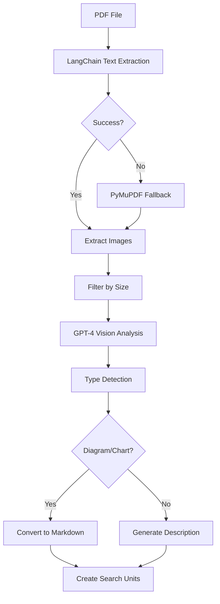

# PDF Processing with LangChain & AI Image Analysis

DocQuest now features **advanced PDF processing** that goes beyond simple text extraction to intelligently analyze and convert visual content.

## 🚀 Enhanced Capabilities

### **Text Extraction**
- **Primary**: LangChain UnstructuredPDFLoader for superior text extraction
- **Fallback**: PyMuPDF for compatibility with all PDF types
- **Page-aware**: Each page becomes a separate searchable unit

### **🤖 AI Image Analysis**
- **GPT-4 Vision Integration**: Analyzes images within PDFs
- **Smart Type Detection**: Identifies diagrams, charts, photos, logos
- **Markdown Conversion**: Architecture diagrams → structured markdown
- **Size Filtering**: Skips decorative images (< 100x100 pixels)

## 📋 Supported Image Types

| Image Type | Processing | Output Format |
|------------|------------|---------------|
| **Architecture Diagrams** | AI analysis + conversion | Structured markdown with headers/lists |
| **Flowcharts** | AI analysis + conversion | Step-by-step markdown description |
| **Organizational Charts** | AI analysis + conversion | Hierarchical markdown structure |
| **Technical Diagrams** | AI analysis + conversion | Component descriptions in markdown |
| **Photos/Logos** | AI analysis | Brief descriptive text |
| **Decorative Images** | Filtered out | (Not processed) |

## 🔧 Configuration

### Prerequisites
```bash
pip install langchain langchain-community langchain-openai langchain-unstructured pillow pdf2image
```

### OpenAI API Key
Add your OpenAI API key to `config/config.yaml`:
```yaml
openai_api_key: "sk-proj-your-key-here"
```

## 📄 Example Processing

### Input PDF Page
```
[Text content] + [Architecture diagram showing API → Database → Frontend]
```

### DocQuest Output Units
```
1. page_1: "Text content from the page..."
2. page_1_image_1_diagram: 
   [IMAGE ANALYSIS]
   # System Architecture
   ## Components
   - **API Layer**: Handles requests and business logic
   - **Database**: Stores application data
   - **Frontend**: User interface and interactions
   
   ## Data Flow
   1. User requests → API Layer
   2. API processes → Database queries
   3. Results → Frontend display
```

## 🎯 Processing Flow



## 🚨 Error Handling

- **Missing API Key**: Skips image analysis, continues with text
- **LangChain Failure**: Falls back to PyMuPDF text extraction
- **Vision API Errors**: Creates basic image descriptions
- **Corrupted Images**: Logs error and continues processing

## 💡 Benefits

1. **Comprehensive Content**: Captures both text and visual information
2. **Intelligent Conversion**: Diagrams become searchable text content
3. **Robust Fallbacks**: Multiple layers of error handling
4. **Quest-Ready**: All content becomes part of the searchable knowledge base

## 🔍 Search Examples

After processing a PDF with architecture diagrams:

```bash
# Query: "What components are in the system architecture?"
# Matches: Converted markdown from diagram analysis

# Query: "How does data flow through the application?"  
# Matches: Step-by-step descriptions from flowchart conversion
```

The enhanced PDF processor transforms static visual content into dynamic, searchable knowledge! 🎯
