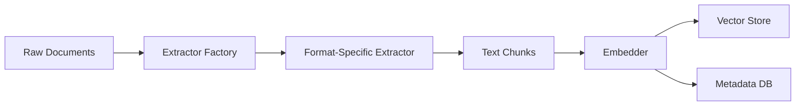

# Document Ingestion Pipeline

This directory implements the complete document processing pipeline, transforming raw documents into searchable vector embeddings and structured metadata.

## Architecture

The ingestion pipeline follows a modular design with three main stages:

```
Documents → Extractors → Processors → Storage
```

## Components

### [extractors/](extractors/)
Modular document extractors for different file formats:
- **PDF**: Advanced processing with LangChain + AI image analysis
- **DOCX**: Word document text extraction
- **PPTX**: PowerPoint slide-by-slide processing  
- **XLSX**: Excel spreadsheet processing with smart sheet prioritization
- **TXT**: Plain text file processing
- **Email**: Outlook (.msg) and standard (.eml) email processing

### [processors/](processors/)  
Text processing and embedding generation:
- **chunker.py**: NLTK-based text chunking with configurable overlap
- **embedder.py**: Sentence transformer embedding generation

### [storage/](storage/)
Persistent storage for vectors and metadata:
- **vector_store.py**: FAISS + SQLite hybrid storage system
- **knowledge_graph.py**: Entity and relationship storage

### [pipeline.py](pipeline.py)
Main orchestration logic that coordinates the entire ingestion workflow.

## Data Flow



## Usage Patterns

### Full Document Processing
```bash
python -m backend.src.ingestion.pipeline --mode full
```

### Incremental Updates
```bash
python -m backend.src.ingestion.pipeline --mode incremental
```

### Processing Specific File Types
```bash
python -m backend.src.ingestion.pipeline --file-type pdf
python -m backend.src.ingestion.pipeline --file-type xlsx --all-sheets
```

## Extension Points

### Adding New File Formats
1. Create extractor class inheriting from `extractors/base.py`
2. Implement `extract()` method returning `List[Tuple[unit_id, text]]`
3. Register in `extractors/__init__.py` factory
4. Add comprehensive tests

### Custom Text Processing
1. Extend `processors/chunker.py` for different chunking strategies
2. Modify `processors/embedder.py` for alternative embedding models
3. Update `pipeline.py` to use custom processors

### Enhanced Storage
1. Extend `storage/vector_store.py` for additional metadata
2. Modify `storage/knowledge_graph.py` for custom relationships
3. Update storage interfaces in pipeline

## Configuration

Key settings in `../shared/config.yaml`:
- `sync_root`: Source document directory
- `chunk_size`: Text chunk size (default: 800 characters)
- `chunk_overlap`: Overlap between chunks (default: 150 characters)
- `embed_model`: Sentence transformer model name
- Processing limits per file type

## Performance Considerations

- **Memory Usage**: Scales with document corpus size
- **Processing Speed**: Varies by file type complexity
- **Storage Growth**: Linear with document volume
- **Batch Processing**: Optimized for large document collections

## Error Handling

- Graceful handling of permission errors and malformed files
- Individual file failures don't stop batch processing
- Comprehensive logging with progress tracking
- Automatic retry mechanisms for transient failures

## Links

- **Architecture Overview**: [../../docs/ARCHITECTURE.md](../../docs/ARCHITECTURE.md)
- **Format-Specific Details**: [../../docs/](../../docs/) (PDF_PROCESSING.md, EXCEL_PROCESSING.md, etc.)
- **Configuration**: [../shared/README.md](../shared/README.md)
- **Storage Details**: [storage/README.md](storage/README.md)