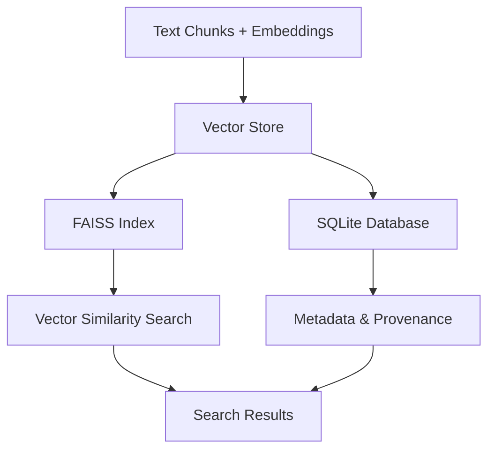

# Storage Components

This directory implements the storage layer for DocQuest, providing persistent storage for both vector embeddings and structured metadata using a hybrid FAISS + SQLite approach.

## Architecture

The storage system combines two complementary technologies:
- **FAISS**: High-performance vector similarity search
- **SQLite**: Structured metadata and relational queries



## Components

### [vector_store.py](vector_store.py)
Hybrid vector storage with metadata management:

**Core Features**:
- **FAISS Integration**: IndexFlatL2 for exact similarity search
- **SQLite Metadata**: Rich metadata storage with SQL queries
- **Deduplication**: SHA1-based chunk IDs prevent duplicate storage
- **Persistence**: Automatic index saving to `data/vector.index`
- **Batch Operations**: Efficient bulk inserts and updates

**Key Methods**:
```python
def upsert(chunk_ids, vectors, metadata)  # Insert/update chunks
def search(query_vector, top_k)           # Vector similarity search  
def get_metadata(chunk_ids)               # Retrieve chunk metadata
def delete_by_file(file_path)             # Remove file's chunks
```

### [knowledge_graph.py](knowledge_graph.py)
Entity and relationship storage for semantic knowledge:

**Core Features**:
- **Entity Management**: Store and query named entities
- **Relationship Tracking**: Model connections between entities
- **Graph Queries**: Find related entities and concepts
- **Integration**: Works alongside vector storage for enriched search

## Data Models

### Vector Storage Schema

**FAISS Index**:
- Vector dimensionality: 384 (sentence-transformers/all-MiniLM-L6-v2)
- Index type: IndexFlatL2 (exact L2 distance)
- Storage format: Binary index file

**SQLite Metadata Schema**:
```sql
CREATE TABLE chunks (
    chunk_id TEXT PRIMARY KEY,    -- SHA1 hash of content
    file_path TEXT,               -- Source document path
    unit_id TEXT,                 -- Page/slide/sheet identifier  
    content TEXT,                 -- Original text content
    chunk_index INTEGER,          -- Position within document
    created_at TIMESTAMP,         -- Processing timestamp
    file_hash TEXT                -- Source file hash
);
```

### Knowledge Graph Schema
```sql
CREATE TABLE entities (
    id INTEGER PRIMARY KEY,
    name TEXT UNIQUE,
    entity_type TEXT,
    confidence REAL
);

CREATE TABLE relationships (
    id INTEGER PRIMARY KEY, 
    source_entity_id INTEGER,
    target_entity_id INTEGER,
    relationship_type TEXT,
    confidence REAL
);
```

## Usage Patterns

### Document Ingestion
```python
from backend.src.ingestion.storage.vector_store import VectorStore

store = VectorStore()
store.upsert(
    chunk_ids=["chunk_1", "chunk_2"],
    vectors=embeddings,
    metadata=[
        {"file_path": "doc.pdf", "unit_id": "page_1", "content": "..."},
        {"file_path": "doc.pdf", "unit_id": "page_2", "content": "..."}
    ]
)
```

### Semantic Search
```python
# Query processing
results = store.search(
    query_vector=embed_query("What are the requirements?"),
    top_k=8
)
# Returns: List[Tuple[chunk_id, similarity_score, metadata]]
```

### Knowledge Graph Queries
```python
from backend.src.ingestion.storage.knowledge_graph import KnowledgeGraph

kg = KnowledgeGraph()
entities = kg.find_entities_by_type("PERSON")
related = kg.find_related_entities(entity_id=123)
```

## Performance Characteristics

### Vector Search Performance
- **Index Type**: Exact search (no approximation)
- **Search Speed**: ~1ms for 10K vectors on modern CPU
- **Memory Usage**: Linear with vector count (384 * 4 bytes per vector)
- **Disk Usage**: Index file size scales with corpus

### Metadata Query Performance  
- **SQLite**: Optimized for read-heavy workloads
- **Indexing**: Automatic indexes on file_path and chunk_id
- **Query Speed**: Sub-millisecond for typical metadata lookups
- **Concurrent Access**: Read-heavy optimization with WAL mode

## Configuration

### Vector Store Settings
```yaml
vector_store:
  index_path: "data/vector.index"          # FAISS index file
  metadata_db: "data/docmeta.db"           # SQLite database
  similarity_threshold: 0.7                # Minimum similarity score
  max_results: 100                         # Maximum search results
```

### Knowledge Graph Settings
```yaml
knowledge_graph:
  db_path: "data/knowledge_graph.db"       # Knowledge graph database
  confidence_threshold: 0.8               # Minimum entity confidence
  relationship_types: ["contains", "mentions", "related_to"]
```

## Maintenance Operations

### Index Rebuilding
```python
# Complete index rebuild
store.rebuild_index()

# Incremental updates
store.upsert(new_chunks, new_vectors, new_metadata)
```

### Database Cleanup
```python
# Remove deleted documents
store.cleanup_orphaned_chunks()

# Optimize database
store.vacuum_database()
```

### Backup and Recovery
```bash
# Backup vector index and metadata
cp data/vector.index data/vector.index.backup
cp data/docmeta.db data/docmeta.db.backup

# Recovery (restore from backup)
cp data/vector.index.backup data/vector.index
cp data/docmeta.db.backup data/docmeta.db
```

## Extension Points

### Custom Storage Backends
```python
class CustomVectorStore(VectorStore):
    """Implement alternative storage backend"""
    def search(self, query_vector, top_k):
        # Custom search implementation
        pass
```

### Enhanced Metadata
```python
# Add custom metadata fields
metadata = {
    "file_path": "doc.pdf",
    "unit_id": "page_1", 
    "content": "...",
    "custom_field": "custom_value",  # Additional metadata
    "processing_version": "v2.1"
}
```

### Alternative Vector Indexes
- **FAISS IVF**: Approximate search for large corpora
- **HNSW**: Hierarchical navigable small world graphs
- **Product Quantization**: Compressed vector storage
- **GPU Indexes**: CUDA-accelerated search

## Error Handling

### Common Issues
- **Index corruption**: Automatic rebuild from metadata
- **Database locks**: Retry mechanisms with exponential backoff
- **Memory constraints**: Batch processing for large operations
- **Disk space**: Monitoring and cleanup procedures

### Recovery Procedures
- **Partial failure**: Individual chunk reprocessing
- **Complete failure**: Rebuild from source documents
- **Data inconsistency**: Validation and repair utilities

## Links

- **Architecture Overview**: [../../../docs/ARCHITECTURE.md](../../../docs/ARCHITECTURE.md)
- **Ingestion Pipeline**: [../README.md](../README.md)
- **Configuration**: [../../shared/README.md](../../shared/README.md)
- **Query Processing**: [../../querying/README.md](../../querying/README.md)