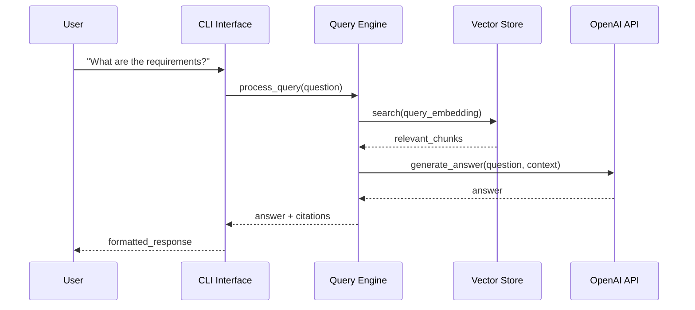

# User Interfaces

This directory contains user-facing interfaces for DocQuest, providing multiple ways to interact with the document retrieval and query system.

## Architecture

DocQuest provides a layered interface architecture supporting different interaction patterns:

```
Users → Interface Layer → Query Processing → Document Storage
```

## Components

### [cli/](cli/)
Command-line interface for interactive document querying:
- **Primary Interface**: Direct question-answering with citations
- **Target Users**: Developers, power users, automation scripts
- **Features**: Rich text output, progress tracking, verbose logging

## Interface Patterns

### Command-Line Interface (CLI)
**Purpose**: Direct, scriptable access to document querying capabilities.

**Usage**:
```bash
# Interactive querying
python -m backend.src.interface.cli.ask "What are the project requirements?"

# Batch processing
echo "What is the budget?" | python -m backend.src.interface.cli.ask
```

**Output Format**:
- **Answer**: Generated response from LLM
- **Citations**: Source file paths and unit IDs
- **Context**: Relevant document chunks used
- **Metadata**: Processing time, confidence scores

### Web API Interface
**Purpose**: RESTful endpoints for web applications and integrations.

**Location**: [../querying/api.py](../querying/api.py)

**Endpoints**:
```http
POST /query                    # Submit questions
GET /documents                 # List indexed documents  
GET /health                   # System status
```

## Data Flow



## Usage Patterns

### Interactive Development
```bash
# Quick document queries during development
python -m backend.src.interface.cli.ask "Show me the API endpoints"

# Debug with verbose output  
python -m backend.src.interface.cli.ask "What is the architecture?" --verbose
```

### Automation and Scripting
```bash
# Batch question processing
for question in "${questions[@]}"; do
    python -m backend.src.interface.cli.ask "$question" >> results.txt
done

# Integration with CI/CD
python -m backend.src.interface.cli.ask "What tests need updating?" \
    --format json > test_analysis.json
```

### Web Integration
```javascript
// Frontend integration via API
const response = await fetch('/query', {
    method: 'POST',
    headers: {'Content-Type': 'application/json'},
    body: JSON.stringify({question: 'What are the requirements?'})
});
const result = await response.json();
```

## Configuration

### CLI Settings
```yaml
cli:
  default_output_format: "text"      # "text", "json", "markdown"
  max_context_length: 8000          # Maximum context for LLM
  citation_format: "path:unit"       # Citation display format
  verbose_logging: false            # Detailed processing logs
```

### API Settings  
```yaml
api:
  host: "0.0.0.0"                   # Bind address
  port: 8000                        # Listen port
  cors_origins: ["*"]               # CORS configuration
  rate_limit: "100/minute"          # Request rate limiting
```

## Extension Points

### New Interface Types
```python
# Add new interface implementations
class GraphQLInterface:
    """GraphQL interface for complex queries"""
    
class WebSocketInterface:
    """Real-time streaming interface"""
    
class ChatInterface:
    """Conversational chat interface"""
```

### Custom Output Formats
```python
# CLI output formatters
def custom_formatter(answer: str, citations: List[str]) -> str:
    """Implement domain-specific output formatting"""
    return formatted_output
```

### Authentication and Authorization
```python
# API security extensions
class AuthenticationMiddleware:
    """Add user authentication to API endpoints"""
    
class AuthorizationService:
    """Control access to specific documents/queries"""
```

## Error Handling

### CLI Error Patterns
- **No results found**: Graceful "No relevant information found" message
- **API connectivity**: Clear error messages with retry suggestions
- **Configuration issues**: Helpful diagnostic information
- **Invalid queries**: Input validation with correction suggestions

### API Error Responses
```json
{
    "error": "query_processing_failed",
    "message": "Unable to process query due to...",
    "suggestion": "Try rephrasing your question",
    "error_code": 4001
}
```

## Performance Considerations

### CLI Performance
- **Startup Time**: Minimize import overhead
- **Query Response**: Target <2 seconds for typical queries
- **Memory Usage**: Efficient for batch processing
- **Caching**: Session-based caching for repeated queries

### API Performance
- **Concurrent Requests**: Handle multiple simultaneous queries
- **Response Time**: Sub-second for cached results
- **Resource Management**: Connection pooling and cleanup
- **Monitoring**: Request metrics and health checks

## Development Guidelines

### Adding New Commands
```python
# CLI command structure
@click.command()
@click.argument('question')
@click.option('--format', default='text')
def new_command(question: str, format: str):
    """Implement new CLI functionality"""
    pass
```

### API Endpoint Development
```python
# FastAPI endpoint pattern
@app.post("/new-endpoint")
async def new_endpoint(request: RequestModel):
    """Add new API functionality"""
    return ResponseModel(...)
```

### Interface Testing
- **CLI Testing**: Command-line integration tests
- **API Testing**: HTTP endpoint testing with pytest
- **User Experience**: Manual testing for usability
- **Performance Testing**: Load testing for API endpoints

## Links

- **CLI Implementation**: [cli/README.md](cli/README.md)
- **API Documentation**: [../querying/api.py](../querying/api.py)
- **Configuration**: [../shared/README.md](../shared/README.md)
- **Architecture Overview**: [../../docs/ARCHITECTURE.md](../../docs/ARCHITECTURE.md)