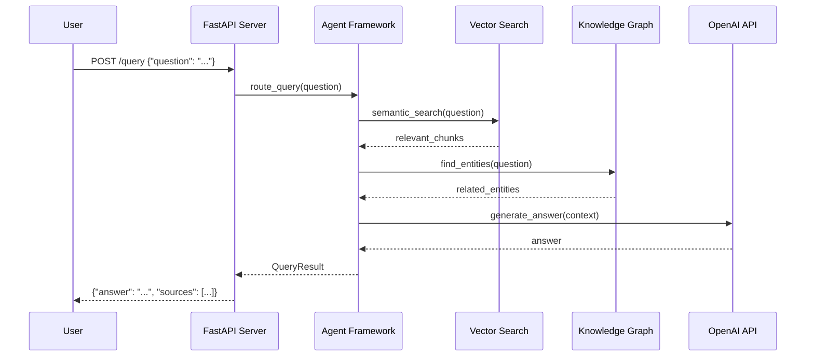

# Query Processing and Agents

This directory implements the query processing engine and multi-agent framework for DocQuest, transforming user questions into contextual answers using vector search, knowledge graphs, and LLM integration.

## Architecture

The querying system employs a multi-agent architecture with pluggable components:

```
User Query → Agent Framework → Search + Knowledge Graph → LLM Processing → Response
```

## Components

### [agents/](agents/)
Multi-agent framework with plugin-based architecture:
- **Plugin System**: Extensible agents for different query types
- **Agent Orchestration**: Intelligent routing and coordination
- **Context Management**: Maintains conversation state and context
- **Capability Discovery**: Dynamic agent registration and discovery

### [search/](search/)
Vector search and retrieval components:
- **Semantic Search**: Vector similarity-based document retrieval
- **Hybrid Search**: Combines vector and metadata filtering
- **Result Ranking**: Relevance scoring and result optimization
- **Query Expansion**: Enhanced search through query understanding

### [api.py](api.py)
FastAPI web service providing RESTful endpoints:
- **Query Endpoint**: POST /query for question answering
- **Document Management**: GET /documents for indexed document listing
- **Health Monitoring**: GET /health for system status
- **WebSocket Support**: Real-time streaming for long queries

## Data Flow



## Agent Framework

### Plugin Architecture
Agents implement a common interface for extensibility:

```python
class Plugin(ABC):
    """Base class for all query processing plugins"""
    
    @abstractmethod
    def execute(self, query: str, context: Dict) -> Dict:
        """Process query and return results"""
        pass
    
    @abstractmethod
    def get_info(self) -> Dict:
        """Return plugin metadata and capabilities"""
        pass
    
    @abstractmethod
    def validate_params(self, params: Dict) -> bool:
        """Validate plugin parameters"""
        pass
```

### Available Agents

**Document Search Agent**:
- Vector similarity search across document corpus
- Handles general question-answering queries
- Provides source citations and confidence scores

**Knowledge Graph Agent**:
- Entity and relationship-based queries
- Explores semantic connections between concepts
- Supports graph traversal and pattern matching

**Metadata Agent**:
- File-based queries and document discovery
- Temporal and categorical filtering
- Document property and statistics queries

**Summarization Agent**:
- Multi-document summarization tasks
- Thematic analysis and key insight extraction
- Configurable summary length and focus

## Search Components

### Vector Search
```python
from backend.src.querying.search import VectorSearchEngine

engine = VectorSearchEngine()
results = engine.search(
    query="What are the requirements?",
    top_k=8,
    filters={"file_type": "pdf"}
)
```

### Knowledge Graph Search
```python
from backend.src.querying.search import KnowledgeGraphSearch

kg_search = KnowledgeGraphSearch()
entities = kg_search.find_entities("project requirements")
relationships = kg_search.find_relationships(entity_id=123)
```

## API Interface

### Core Endpoints

**Query Processing**:
```http
POST /query
Content-Type: application/json

{
    "question": "What are the project requirements?",
    "max_results": 5,
    "include_context": true
}
```

**Response Format**:
```json
{
    "answer": "The project requirements include...",
    "sources": [
        {"file": "requirements.pdf", "unit": "page_2", "confidence": 0.92}
    ],
    "context_chunks": ["relevant text excerpts..."],
    "processing_time": 1.23,
    "agent_used": "document_search"
}
```

**Document Listing**:
```http
GET /documents?file_type=pdf&limit=20
```

**Health Check**:
```http
GET /health
```

## Configuration

### Agent Settings
```yaml
agents:
  default_agent: "document_search"        # Primary agent for queries
  timeout: 30                           # Maximum processing time
  max_context_length: 8000              # LLM context window
  enable_knowledge_graph: true         # Use KG for enhanced search
```

### Search Configuration
```yaml
search:
  vector_top_k: 8                       # Initial vector search results
  rerank_enabled: true                  # Post-processing reranking
  similarity_threshold: 0.7             # Minimum similarity score
  hybrid_weight: 0.5                    # Vector vs. metadata balance
```

### API Configuration
```yaml
api:
  host: "0.0.0.0"                      # Server bind address
  port: 8000                           # Listen port
  workers: 4                           # Uvicorn worker processes
  cors_origins: ["*"]                  # CORS configuration
  rate_limit: "100/minute"             # Request rate limiting
```

## Usage Patterns

### Direct API Usage
```python
import requests

response = requests.post('http://localhost:8000/query', json={
    'question': 'What are the technical requirements?',
    'max_results': 5
})
result = response.json()
```

### Agent Development
```python
from backend.src.querying.agents.plugins import Plugin

class CustomAgent(Plugin):
    def execute(self, query: str, context: Dict) -> Dict:
        # Custom query processing logic
        return {"answer": "...", "sources": [...]}
    
    def get_info(self) -> Dict:
        return {
            "name": "custom_agent",
            "description": "Handles domain-specific queries",
            "capabilities": ["specialized_search", "custom_analysis"]
        }
```

### Search Customization
```python
from backend.src.querying.search import VectorSearchEngine

class CustomSearchEngine(VectorSearchEngine):
    def search(self, query: str, **kwargs):
        # Custom search implementation
        return enhanced_results
```

## Extension Points

### New Agent Types
1. **Domain-Specific Agents**: Industry or use-case specific processing
2. **Multi-Modal Agents**: Image, audio, or video content processing
3. **Conversational Agents**: Multi-turn conversation handling
4. **Analytics Agents**: Statistical analysis and trend identification

### Search Enhancements
1. **Query Understanding**: NLP-based query parsing and expansion
2. **Result Fusion**: Multiple search strategy combination
3. **Personalization**: User-specific result customization
4. **Real-time Indexing**: Live document updates and search

### API Extensions
1. **Authentication**: User management and access control
2. **Caching**: Response caching for performance
3. **Monitoring**: Detailed metrics and logging
4. **Webhooks**: Event-driven integrations

## Performance Optimization

### Query Processing
- **Async Processing**: Non-blocking query handling
- **Connection Pooling**: Efficient database connections
- **Result Caching**: Repeated query optimization
- **Batch Operations**: Multiple queries in single request

### Resource Management
- **Memory Usage**: Efficient embedding and context management
- **CPU Utilization**: Parallel processing for complex queries
- **I/O Optimization**: Minimized database and file system access
- **Network Efficiency**: Optimized API communication

## Testing Strategies

### Unit Testing
```python
def test_document_search_agent():
    agent = DocumentSearchAgent()
    result = agent.execute("test query", {})
    assert "answer" in result
    assert "sources" in result
```

### Integration Testing
```python
def test_api_query_endpoint():
    response = client.post("/query", json={"question": "test"})
    assert response.status_code == 200
    assert "answer" in response.json()
```

### Performance Testing
```python
def test_query_performance():
    start_time = time.time()
    result = process_query("complex query")
    elapsed = time.time() - start_time
    assert elapsed < 5.0  # Sub-5-second response
```

## Links

- **Agent Plugin Development**: [agents/README.md](agents/README.md)
- **Search Implementation**: [search/README.md](search/README.md)
- **Configuration**: [../shared/README.md](../shared/README.md)
- **System Architecture**: [../../docs/ARCHITECTURE.md](../../docs/ARCHITECTURE.md)
- **API Documentation**: [api.py](api.py)