# DocRAG Architecture

This document describes the architecture and data flow of the DocRAG (Document Retrieval-Augmented Generation) system.

## System Overview

DocRAG is a local RAG pipeline that processes documents from local folders and enables natural language querying using vector search and OpenAI. The system is designed for personal document collections, team folders, or any local document repository.

## Architecture Diagram

```mermaid
graph TB
    %% User Interface Layer
    subgraph "User Interface"
        CLI[CLI Interface<br/>cli/ask.py]
        API[FastAPI Web API<br/>api/app.py]
        WebUI[Next.js Web UI<br/>package.json]
    end

    %% Document Sources
    subgraph "Document Sources"
        LocalDocs[Local Documents<br/>📁 sync_root folder]
        PDFs[PDF Files<br/>📄 .pdf]
        Word[Word Docs<br/>📄 .docx]
        Excel[Excel Files<br/>📊 .xlsx]
        PPT[PowerPoint<br/>📄 .pptx]
        TXT[Text Files<br/>📄 .txt]
    end

    %% Processing Pipeline
    subgraph "Document Processing Pipeline"
        Watcher[File Watcher<br/>watcher/watch.py<br/>🔍 Monitors changes]
        Extractor[Text Extractor<br/>ingest/extractor.py<br/>📝 Multi-format parsing]
        Chunker[Text Chunker<br/>ingest/chunker.py<br/>✂️ NLTK-based chunking]
        Embedder[Embedding Generator<br/>ingest/embed.py<br/>🧠 sentence-transformers]
        Ingest[Ingestion Controller<br/>ingest/ingest.py<br/>🔄 Orchestrates pipeline]
    end

    %% Storage Layer
    subgraph "Storage Layer"
        VectorDB[Vector Database<br/>FAISS IndexFlatL2<br/>🗃️ 384-dim embeddings]
        MetaDB[Metadata Database<br/>SQLite<br/>📋 File metadata & chunks]
        ConfigFile[Configuration<br/>config/config.yaml<br/>⚙️ Settings & API keys]
    end

    %% External Services
    subgraph "External Services"
        OpenAI[OpenAI API<br/>🤖 GPT-4o-mini<br/>Question answering]
        HuggingFace[Hugging Face<br/>🤗 Sentence Transformers<br/>Text embeddings]
    end

    %% Data Flow
    LocalDocs --> Watcher
    PDFs --> Extractor
    Word --> Extractor
    Excel --> Extractor
    PPT --> Extractor
    TXT --> Extractor
    
    Watcher --> Ingest
    Ingest --> Extractor
    Extractor --> Chunker
    Chunker --> Embedder
    Embedder --> VectorDB
    Embedder --> MetaDB
    
    CLI --> VectorDB
    API --> VectorDB
    WebUI --> API
    
    VectorDB --> OpenAI
    CLI --> OpenAI
    API --> OpenAI
    
    Embedder --> HuggingFace
    ConfigFile --> Ingest
    ConfigFile --> OpenAI

    %% Styling
    classDef userInterface fill:#e1f5fe
    classDef processing fill:#f3e5f5
    classDef storage fill:#e8f5e8
    classDef external fill:#fff3e0
    classDef documents fill:#fce4ec

    class CLI,API,WebUI userInterface
    class Watcher,Extractor,Chunker,Embedder,Ingest processing
    class VectorDB,MetaDB,ConfigFile storage
    class OpenAI,HuggingFace external
    class LocalDocs,PDFs,Word,Excel,PPT,TXT documents
```



## Component Details

### Document Processing Flow


### Query Processing Flow


## Key Architecture Decisions

### 1. Local-First Design
- **Rationale**: Privacy, control, and offline capability
- **Implementation**: All processing happens locally, only LLM calls go to OpenAI
- **Benefits**: No data leaves your machine except for question answering

### 2. Modular Processing Pipeline
- **Rationale**: Maintainability, testability, and extensibility
- **Implementation**: Separate modules for extraction, chunking, embedding, storage
- **Benefits**: Easy to add new file formats or change processing logic

### 3. FAISS + SQLite Hybrid Storage
- **Rationale**: Performance for vector search + flexibility for metadata
- **Implementation**: FAISS for vector similarity, SQLite for rich metadata queries
- **Benefits**: Fast similarity search with detailed provenance tracking

### 4. Enhanced Excel Processing
- **Rationale**: Excel files contain complex structured data requiring special handling
- **Implementation**: Smart sheet prioritization, empty sheet filtering, relationship preservation
- **Benefits**: Better extraction quality from business documents

## Data Flow Patterns

### 1. Document Ingestion
```
File Change → Watcher → Extractor → Chunker → Embedder → Vector Store
```

### 2. Query Processing
```
User Query → Vector Search → Context Retrieval → LLM Processing → Response
```

### 3. Incremental Updates
```
Modified File → Hash Comparison → Selective Re-processing → Vector Store Update
```

## Configuration Architecture

```mermaid
graph LR
    subgraph "Configuration Management"
        Template[config.yaml.template<br/>📝 Safe for git]
        Config[config.yaml<br/>🔒 Local secrets]
        Settings[settings object<br/>⚙️ Runtime config]
    end
    
    Template --> Config
    Config --> Settings
    Settings --> Pipeline[Processing Pipeline]
    Settings --> API[API Services]
    
    classDef config fill:#fff9c4
    class Template,Config,Settings config
```



## Performance Characteristics

- **Vector Dimensionality**: 384 (sentence-transformers/all-MiniLM-L6-v2)
- **Chunk Size**: 800 characters with 150 character overlap
- **Search Results**: Top-8 relevant chunks for context
- **Excel Limits**: 100MB files, 15 sheets (smart prioritization), 2000 rows/sheet
- **Memory Usage**: Scales with document corpus size and concurrent processing

## Security Model

```mermaid
graph TB
    subgraph "Security Boundaries"
        LocalSystem[Local System<br/>🔒 All document processing]
        GitRepo[Git Repository<br/>📁 Public code only]
        OpenAIAPI[OpenAI API<br/>🌐 Query processing only]
    end
    
    LocalSystem -.->|API calls only| OpenAIAPI
    LocalSystem -->|Code only| GitRepo
    
    LocalSystem --> ConfigLocal[config.yaml<br/>🔐 Never committed]
    GitRepo --> ConfigTemplate[config.yaml.template<br/>📝 Safe template]
```



## Extensibility Points

1. **New File Formats**: Add extractors in `ingest/extractor.py`
2. **Different Embeddings**: Modify `ingest/embed.py` 
3. **Alternative LLMs**: Update `cli/ask.py` and `api/app.py`
4. **Custom Chunking**: Extend `ingest/chunker.py`
5. **Additional Metadata**: Enhance `ingest/vector_store.py`

## Deployment Patterns

### Local Development
```bash
python -m ingest.ingest  # Document processing
python -m cli.ask        # CLI queries
uvicorn api.app:app      # Web API
```

### Production Deployment
- File watcher for real-time updates
- Web UI for team access
- Automated reindexing workflows
- Health monitoring and logging
